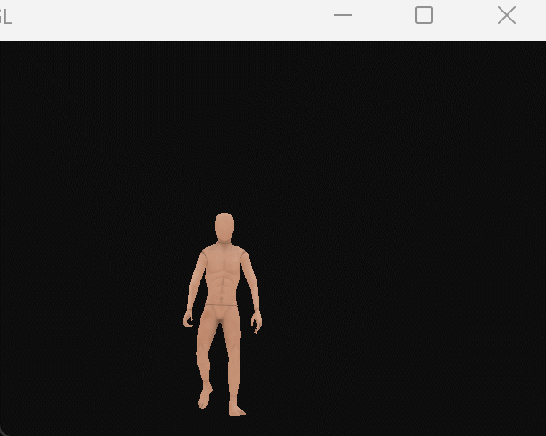

# Opengl骨骼动画 
### 本教程致力于指导opengl新手小白在自己写的opengl程序中创建具有一系列动作的模型。
### 总共分为三个阶段（part），每个part中均包含该part的教程（.md文件）。
## part1
我会教你如何使用assim这个通用的模型导入库，它可以导入模型也可以导入具有动作的模型并且支持大多数的模型、动画格式。
学会了它，你就能导入从网上下载的模型、动画，马上就能在程序中看到效果。
但是你如果想要自己的模型你可以往下看，如果你只专注于程序可以止步。

  

## part2
教你如何在blender中给模型绑定骨骼
## part2
教你如何建模一个模型
