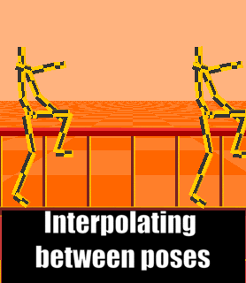

### 骨骼动画的原理

就像人体的骨骼与关节一样，程序中人物模型也是需要绑定一套骨骼来控制人物模型的动作

1. 将骨骼绑定到角色：建立骨骼对模型顶点的映射关系 即 一个顶点可以受到最多4块骨骼的影响，其中每块骨骼的影响大小由**权重**控制，每个顶点的控制骨骼的权重加起来等于1。这样在骨骼移动的时候模型也会跟着移动。

2. 设置骨骼动画：把你想要的角色动画拆解成几个关键帧，你只需要在每个关键帧上给骨骼摆造型。比如一个走路的动画，你只需要设置：1抬前腿,伸左手2抬后腿，伸右手（实际上要设置大概8个关键帧让动作更流畅）的关键帧。这样关键帧变动->骨骼造型变动->模型变动

3. 程序插值：在计算机程序中（建模软件或者opengl）实现：在每个关键帧中平滑地插入更多关键帧，让动画更流畅。

     
    

插帧通过根据比例调整前后关键帧中相同骨骼的位移、旋转、缩放实现：