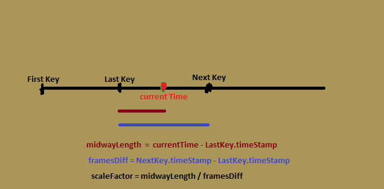

### 骨骼动画的原理

就像人体的骨骼与关节一样，程序中人物模型也是需要绑定一套骨骼来控制人物模型的动作

1. 将骨骼绑定到角色：建立骨骼对模型顶点的映射关系 即 一个顶点可以受到最多4块骨骼的影响，其中每块骨骼的影响大小由**权重**控制，每个顶点的控制骨骼的权重加起来等于1。这样在骨骼移动的时候模型也会跟着移动。

2. 设置骨骼动画：把你想要的角色动画拆解成几个关键帧，你只需要在每个关键帧上给骨骼摆造型。比如一个走路的动画，你只需要设置：1抬前腿,伸左手2抬后腿，伸右手（实际上要设置大概8个关键帧让动作更流畅）的关键帧。这样关键帧变动->骨骼造型变动->模型变动

3. 程序插值：在计算机程序中（建模软件或者opengl程序）实现：在每个关键帧中平滑地插入更多关键帧，让动画更流畅。

<table align="center">
  <tr>
    <td style="padding-right:100px;">
      
    </td>
    <td>
      
    </td>
  </tr>
</table>

插帧通过根据比例调整前后关键帧中相同骨骼的位移、旋转、缩放实现：

<div align="center">
    
</div>

factor=current/diff就是当前要插值的帧在前后两个关键帧的比例位置，currentTime越靠近前一个关键帧factor就越小，越靠近后一个关键帧fctor就越大，我们使用线性插值函数作用前后的位移矩阵和缩放矩阵：

<p align="center"> newMat=lastMat*(1-factor)+nextMat*factor</p>

但是对于旋转矩阵应用这个公式就会出现奇怪的问题，我们采用四元数的球面插值来控制旋转

4. 渲染：我们拿到骨骼插值后的变换矩阵，对顶点变换使顶点随骨骼同步运动，最后把顶点丢到渲染管线当中渲染出动画

### Assimp的原理

在建模软件如blender中可以将创建的动画以各种格式如.fbx、.dae等，每种格式都有自己组织骨骼与模型顶点的方式，它们通常被记录在该格式的官方文档中，我们当然可以阅读该文档了解里面的数据是如何排列的，然后自己写一个readFile程序把数据读到内存当中以便渲染，但是如果采用这种方法，对于如果换了另一种模型的格式的情况，我们都要编写特定的代码然不太合适。所以我们需要一个可以读取任何合适的工具。

Assimp就是这种工具，它可以读取不同格式的模型并且以一种统一的组织方式存储到内存当中，我们就可以编写程序从这种格式当中获取骨骼和模型和动画的数据。

## 代码解析

先从assimp如何组织模型数据开始

我们用assimp读取文件后会返回一个aiScene这是最外层的结构

```cpp
const aiScene* scene = importer.ReadFile(path, aiProcess_Triangulate | aiProcess_GenSmoothNormals | aiProcess_FlipUVs | aiProcess_CalcTangentSpace);
```

通常一个模型是由很多个网格mesh（每个网格有许多的面face，每个面有组成它的顶点vertex），就像一个角色有头，躯干和四肢这些mesh，头又是由三角形，四边形这些face组成，每个三角形又是由3个顶点组成
aiScene中包含一棵节点树，scene->mRootNode 是节点树的根节点，每个节点是一个aiNode*，每个节点中包含对于aiMesh的索引，aiMesh顶点，法线，纹理坐标这些数据，我们第归处理每个节点，拿到里面的数据，这棵树就反应了mesh的层级结构hierarchy

```cpp
void loadModel(string const& path)
{
	Assimp::Importer importer;
	const aiScene* scene = importer.ReadFile(path, aiProcess_Triangulate | aiProcess_GenSmoothNormals | aiProcess_FlipUVs | aiProcess_CalcTangentSpace);

	if (!scene || scene->mFlags & AI_SCENE_FLAGS_INCOMPLETE || !scene->mRootNode)
	{
		cout << "ERROR::ASSIMP::" << importer.GetErrorString() << endl;
		return;
	}

	directory = path.substr(0, path.find_last_of('/'));

	processNode(scene->mRootNode, scene);
}

	void processNode(aiNode* node, const aiScene* scene)
	{
		for (unsigned int i = 0; i < node->mNumMeshes; i++)
		{
			aiMesh* mesh = scene->mMeshes[node->mMeshes[i]];
			meshes.push_back(processMesh(mesh, scene));
		}
		for (unsigned int i = 0; i < node->mNumChildren; i++)
		{
			processNode(node->mChildren[i], scene);
		}
	}
```

`meshes.push_back(processMesh(mesh, scene));`处理mesh，把aiMesh的顶点，法线，纹理坐标这些数据拿到我们自己的mesh中，（aiMesh里面有了，我们还要再组织成我们程序能处理的格式。能不能直接渲染assimp里面的数据？当然可以哈哈，不过实现难度大，生命周期由assimp控制，结构不易掌控后期优化难度大）

我们先来看我们如何组织我们自己的mesh：

```cpp
#pragma once

#include <glad/glad.h>
#include <glm/glm.hpp>
#include <glm/gtc/matrix_transform.hpp>
#include "shader.h"
#include <string>
#include <vector>

using namespace std;

#define MAX_BONE_INFLUENCE 4

struct Vertex
{
	glm::vec3 Position;
	glm::vec3 Normal;
	glm::vec2 TexCoords;
	glm::vec3 Tangent;
	glm::vec3 Bitangent;
	int m_BoneIDs[MAX_BONE_INFLUENCE];
	float m_Weights[MAX_BONE_INFLUENCE];
};

struct Texture
{
	unsigned int id;
	string type;
	string path;
};

class Mesh
{
public:
	vector<Vertex> vertices;
	vector<unsigned int> indices;
	vector<Texture> textures;
	unsigned int VAO;

	Mesh(vector<Vertex> vertices, vector<unsigned int> indices, vector<Texture> textures)
	{
		this->vertices = vertices;
		this->indices = indices;
		this->textures = textures;

		setupMesh();
	}

	void Draw(Shader& shader)
	{
		unsigned int diffuseNr = 1;
		unsigned int specularNr = 1;
		unsigned int normalNr = 1;
		unsigned int heightNr = 1;
		for (unsigned int i = 0; i < textures.size(); i++)
		{
			glActiveTexture(GL_TEXTURE0 + i);

			string number;
			string name = textures[i].type;
			if (name == "texture_diffuse")
				number = std::to_string(diffuseNr++);
			else if (name == "texture_specular")
				number = std::to_string(specularNr++);
			else if (name == "texture_normal")
				number = std::to_string(normalNr++);
			else if (name == "texture_height")
				number = std::to_string(heightNr++);

			glUniform1i(glGetUniformLocation(shader.ID, (name + number).c_str()), i);
			glBindTexture(GL_TEXTURE_2D, textures[i].id);
		}

		glBindVertexArray(VAO);
		glDrawElements(GL_TRIANGLES, static_cast<unsigned int>(indices.size()), GL_UNSIGNED_INT, 0);
		glBindVertexArray(0);

		glActiveTexture(GL_TEXTURE0);
	}

private:
	unsigned int VBO, EBO;

	void setupMesh()
	{
		glGenVertexArrays(1, &VAO);
		glGenBuffers(1, &VBO);
		glGenBuffers(1, &EBO);

		glBindVertexArray(VAO);
		glBindBuffer(GL_ARRAY_BUFFER, VBO);
		glBufferData(GL_ARRAY_BUFFER, vertices.size() * sizeof(Vertex), &vertices[0], GL_STATIC_DRAW);
		
		glBindBuffer(GL_ELEMENT_ARRAY_BUFFER, EBO);
		glBufferData(GL_ELEMENT_ARRAY_BUFFER, indices.size() * sizeof(unsigned int), &indices[0], GL_STATIC_DRAW);

		glEnableVertexAttribArray(0);
		glVertexAttribPointer(0, 3, GL_FLOAT, GL_FALSE, sizeof(Vertex), (void*)0);

		glEnableVertexAttribArray(1);
		glVertexAttribPointer(1, 3, GL_FLOAT, GL_FALSE, sizeof(Vertex), (void*)offsetof(Vertex, Normal));

		glEnableVertexAttribArray(2);
		glVertexAttribPointer(2, 2, GL_FLOAT, GL_FALSE, sizeof(Vertex), (void*)offsetof(Vertex, TexCoords));

		glEnableVertexAttribArray(3);
		glVertexAttribPointer(3, 3, GL_FLOAT, GL_FALSE, sizeof(Vertex), (void*)offsetof(Vertex, Tangent));

		glEnableVertexAttribArray(4);
		glVertexAttribPointer(4, 3, GL_FLOAT, GL_FALSE, sizeof(Vertex), (void*)offsetof(Vertex, Bitangent));

		glEnableVertexAttribArray(5);
		glVertexAttribIPointer(5, 4, GL_INT, sizeof(Vertex), (void*)offsetof(Vertex, m_BoneIDs));

		glEnableVertexAttribArray(6);
		glVertexAttribPointer(6, 4, GL_FLOAT, GL_FALSE, sizeof(Vertex), (void*)offsetof(Vertex, m_Weights));

		glBindVertexArray(0);
	}
};
```

我们的mesh里面包含顶点Vertex的数组vertices，材质Texture的数组textures，索引的数组indices

其中顶点结构体包含位置position法线normal材质坐标texCoord切向量tangent副切向量bitangent还有**被哪些骨骼作用骨骼的索引数组m_boneIDs和对应的每个骨骼影响权重数组m_Weights**
并且最多受到4个骨骼的影响，权重之和为1

材质结构体包含材质创建时分配的id

```cpp
unsigned int textureID;
glGenTextures(1, &textureID);
```

就是这个id
还有纹理的类型type有漫反射镜面反射法线贴图高度图，但是简单起见我们程序只用漫反射贴图
最后是texture的存储位置，用来唯一标记纹理避免重复加载

索引数组就是opengl支持用顶点的索引来渲染

我们的mesh在构造的时候调用setupmesh把顶点绑定了，在draw的时候把纹理绑定了，这是因为顶点跟vao走，但是纹理跟
模型、mesh走，每次渲染不同的模型、mesh都会覆盖纹理

了解了结构就可以来看model是如何加载他们的了

```cpp
Mesh processMesh(aiMesh* mesh, const aiScene* scene)
{
	vector<Vertex> vertices;
	vector<unsigned int> indices;
	vector<Texture> textures;

	for (unsigned int i = 0; i < mesh->mNumVertices; i++)
	{
		Vertex vertex;
		SetVertexBoneDataToDefault(vertex);
		vertex.Position = AssimpGLMHelpers::GetGLMVec(mesh->mVertices[i]);
		vertex.Normal = AssimpGLMHelpers::GetGLMVec(mesh->mNormals[i]);

		if (mesh->mTextureCoords[0])
		{
			glm::vec2 vec;
			vec.x = mesh->mTextureCoords[0][i].x;
			vec.y = mesh->mTextureCoords[0][i].y;
			vertex.TexCoords = vec;
		}
		else
		{
			vertex.TexCoords = glm::vec2(0.0f, 0.0f);
		}
		vertices.push_back(vertex);
	}
	for (unsigned int i = 0; i < mesh->mNumFaces; i++)
	{
		aiFace face = mesh->mFaces[i];
		for (unsigned int j = 0; j < face.mNumIndices; j++)
		{
			indices.push_back(face.mIndices[j]);
		}
	}
	aiMaterial* material = scene->mMaterials[mesh->mMaterialIndex];

	vector<Texture> diffuseMaps = loadMaterialTextures(material, aiTextureType_DIFFUSE, "texture_diffuse");
	textures.insert(textures.end(), diffuseMaps.begin(), diffuseMaps.end());
	vector<Texture> specularMaps = loadMaterialTextures(material, aiTextureType_SPECULAR, "texture_specular");
	textures.insert(textures.end(), specularMaps.begin(), specularMaps.end());
	std::vector<Texture> normalMaps = loadMaterialTextures(material, aiTextureType_HEIGHT, "texture_normal");
	textures.insert(textures.end(), normalMaps.begin(), normalMaps.end());
	std::vector<Texture> heightMaps = loadMaterialTextures(material, aiTextureType_AMBIENT, "texture_height");
	textures.insert(textures.end(), heightMaps.begin(), heightMaps.end());

	ExtractBoneWeightForVertices(vertices, mesh, scene);

	return Mesh(vertices, indices, textures);
}
```

`GetGLMVec`是辅助函数把assimp组织的格式转换成glm格式，我们从aiMesh中读取每个顶点的位置，法线等，构造
成我们的顶点类型扔进我们的mesh的顶点数组

接下来我们处理材质信息：loadMaterialTextures会在aiMaterial里面查找对应类型的材质的相对路径
这时候就可以根据路径判断是不是已经加载过该材质了：

```cpp
for (unsigned int j = 0; j < textures_loaded.size(); j++)
{
	if (std::strcmp(textures_loaded[j].path.data(), str.C_Str()) == 0)
	{
		textures.push_back(textures_loaded[j]);
		skip = true;
		break;
	}
}
```

如果不是我们就加载

```cpp
if (!skip)
{
	Texture texture;
	texture.id = TextureFromFile(str.C_Str(), this->directory);
	texture.type = typeName;
	texture.path = str.C_Str();
	textures.push_back(texture);
	textures_loaded.push_back(texture);
}

unsigned int TextureFromFile(const char* path, const string& directory, bool gamma = false)
{
	string filename = string(path);
	filename = directory + '/' + filename;

	unsigned int textureID;
	glGenTextures(1, &textureID);

	int width, height, nrComponents;
	unsigned char* data = stbi_load(filename.c_str(), &width, &height, &nrComponents, 0);
	if (data)
	{
		GLenum format;
		if (nrComponents == 1)
			format = GL_RED;
		else if (nrComponents == 3)
			format = GL_RGB;
		else if (nrComponents == 4)
			format = GL_RGBA;

		glBindTexture(GL_TEXTURE_2D, textureID);
		glTexImage2D(GL_TEXTURE_2D, 0, format, width, height, 0, format, GL_UNSIGNED_BYTE, data);
		glGenerateMipmap(GL_TEXTURE_2D);

		glTexParameteri(GL_TEXTURE_2D, GL_TEXTURE_WRAP_S, GL_REPEAT);
		glTexParameteri(GL_TEXTURE_2D, GL_TEXTURE_WRAP_T, GL_REPEAT);
		glTexParameteri(GL_TEXTURE_2D, GL_TEXTURE_MIN_FILTER, GL_LINEAR_MIPMAP_LINEAR);
		glTexParameteri(GL_TEXTURE_2D, GL_TEXTURE_MAG_FILTER, GL_LINEAR);

		stbi_image_free(data);
	}
	else
	{
		std::cout << "Texture failed to load at path: " << path << std::endl;
		stbi_image_free(data);
	}

	return textureID;
}
```

这里我们使用一个叫stbi_load的工具加载，当然你用soil2加载也可以

接下来就是关键，我们加载骨骼！

```cpp
void ExtractBoneWeightForVertices(std::vector<Vertex>& vertices, aiMesh* mesh, const aiScene* scene)
{
	auto& boneInfoMap = m_BoneInfoMap;
	int& boneCount = m_BoneCounter;

	for (int boneIndex = 0; boneIndex < mesh->mNumBones; ++boneIndex)
	{
		int boneID = -1;
		std::string boneName = mesh->mBones[boneIndex]->mName.C_Str();
		if (boneInfoMap.find(boneName) == boneInfoMap.end())
		{
			BoneInfo newBoneInfo;
			newBoneInfo.id = boneCount;
			newBoneInfo.offset = AssimpGLMHelpers::ConvertMatrixToGLMFormat(mesh->mBones[boneIndex]->mOffsetMatrix);
			boneInfoMap[boneName] = newBoneInfo;
			boneID = boneCount;
			boneCount++;
		}
		else
		{
			boneID = boneInfoMap[boneName].id;
		}
		assert(boneID != -1);
		auto weights = mesh->mBones[boneIndex]->mWeights;
		int numWeights = mesh->mBones[boneIndex]->mNumWeights;

		for (int weightIndex = 0; weightIndex < numWeights; ++weightIndex)
		{
			int vertexId = weights[weightIndex].mVertexId;
			float weight = weights[weightIndex].mWeight;
			assert(vertexId <= vertices.size());
			SetVertexBoneData(vertices[vertexId], boneID, weight);
		}
	}

}
```

我们遍历aimesh中的所有骨骼，如果发现还没有加载过就加载它。我们
记录它的id并获得它的局部空间矩阵，
它是把模型空间转换成骨骼空间的，你可以把他当做你平时用的模型矩阵

我们在拿到骨骼所影响的顶点，和对该顶点的权重去填写刚才提到
的顶点中的最后两个4个位置的数组

```
int m_BoneIDs[MAX_BONE_INFLUENCE];
float m_Weights[MAX_BONE_INFLUENCE];
```

```cpp
void SetVertexBoneData(Vertex& vertex, int boneID, float weight)
{
	for (int i = 0; i < MAX_BONE_INFLUENCE; i++)
	{
		if (vertex.m_BoneIDs[i] < 0)
		{
			vertex.m_Weights[i] = weight;
			vertex.m_BoneIDs[i] = boneID;
			break;
		}
	}
}
```

好了现在模型和骨骼已经加载完毕了，我们要加载动画了！

骨骼造型pose决定动画，我们先看骨骼